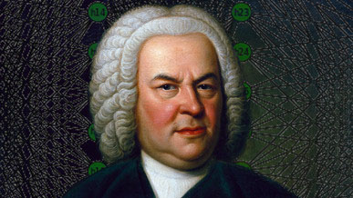

# N.N Bach 
*Generating music in the style of J.S. Bach using LSTM neural networks*

This Jupyter notebook attempts to generate monophonic music in the style of Johann Sebastian Bach. It does so by utilizing Long short-term memory (LSTM) RNN's.

# View the notebook
A HTML rendition of the notebook can be found [here](https://connor-brooks.com/nnBach)

# Listen 
* [Version one](https://connor-brooks.com/nnBach/generated.mp3)
* [Version two](https://connor-brooks.com/nnBach/generated-other-1.mp3)
* [Version three](https://connor-brooks.com/nnBach/generated-other-2.mp3)
